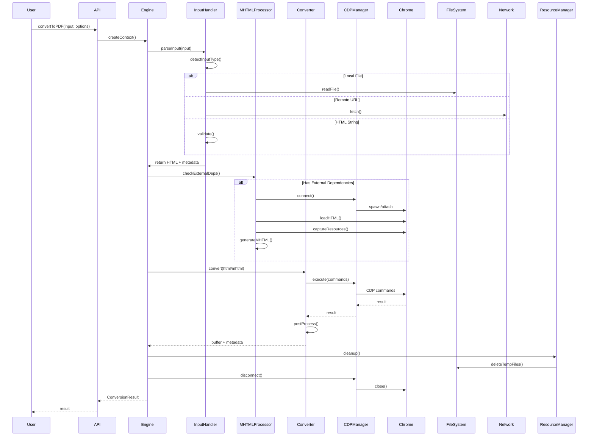

# Functional Specification Document: html-converter-cdt v2.0

## Document Information
- **Product Name**: html-converter-cdt
- **Version**: 2.0
- **Date**: 2025-10-14
- **Status**: Technical Specification
- **Author**: Robin Min
- **Related**: PRD v2.0

---

## Table of Contents

1. [System Architecture](#1-system-architecture)
2. [Design Patterns](#2-design-patterns)
3. [Project Structure](#3-project-structure)
4. [Core Components](#4-core-components)
5. [Format Converters](#5-format-converters)
6. [CDP Management](#6-cdp-management)
7. [Error Handling](#7-error-handling)
8. [Configuration System](#8-configuration-system)
9. [Testing Strategy](#9-testing-strategy)
10. [Security Implementation](#10-security-implementation)
11. [Performance Optimization](#11-performance-optimization)
12. [CLI Implementation](#12-cli-implementation)
13. [API Specifications](#13-api-specifications)
14. [Build & Deployment](#14-build--deployment)

---

## 1. System Architecture

### 1.1 High-Level Architecture

```mermaid
graph TB
    subgraph "User Interface Layer"
        API[Programmatic API<br/>convertToX()]
        CLI[CLI Interface<br/>Commander]
        Unified[Unified API<br/>convert()]
    end

    subgraph "Core Library"
        Engine[Conversion Engine]
        Context[Conversion Context]

        subgraph "Services"
            InputHandler[Input Handler]
            MHTMLProc[MHTML Processor]
            ResourceMgr[Resource Manager]
            ErrorMgr[Error Manager]
            Logger[Logger Service]
        end
    end

    subgraph "Format Converters"
        MHTML[MHTML Converter]
        PDF[PDF Converter]
        Image[Image Converter<br/>PNG/JPEG]
        MD[Markdown Converter]
        DOCX[DOCX Converter]
    end

    subgraph "CDP Layer"
        CDPMgr[CDP Manager<br/>Interface]
        NodeCDP[Node CDP Impl]
        BrowserCDP[Extension CDP Impl]
    end

    subgraph "External Services"
        Chrome[Chrome/Chromium]
        FileSystem[File System]
        Network[Network/HTTP]
    end

    API --> Engine
    CLI --> Engine
    Unified --> Engine

    Engine --> Context
    Engine --> InputHandler
    Engine --> MHTMLProc
    Engine --> ErrorMgr
    Engine --> Logger

    Context --> ResourceMgr

    MHTMLProc --> MHTML
    MHTMLProc --> PDF
    MHTMLProc --> Image
    MHTMLProc --> MD
    MHTMLProc --> DOCX

    MHTML --> CDPMgr
    PDF --> CDPMgr
    Image --> CDPMgr
    MD --> CDPMgr
    DOCX --> CDPMgr

    CDPMgr --> NodeCDP
    CDPMgr --> BrowserCDP

    NodeCDP --> Chrome
    BrowserCDP --> Chrome

    InputHandler --> FileSystem
    InputHandler --> Network
    ResourceMgr --> FileSystem

    style Engine fill:#fff4e6
    style Context fill:#f3e5f5
    style CDPMgr fill:#e8f5e9
    style Chrome fill:#e3f2fd
```

### 1.2 Layered Architecture

| Layer | Responsibility | Dependencies |
|-------|----------------|--------------|
| **Interface** | API/CLI entry points | Core only |
| **Core** | Business logic, orchestration | Services, CDP abstraction |
| **Services** | Shared utilities | None (except Logger) |
| **Converters** | Format-specific logic | Core, CDP, External libs |
| **CDP** | Chrome protocol abstraction | chrome-remote-interface |
| **External** | Third-party integrations | Native libs, file system |

### 1.3 Data Flow Diagram



---

## 2. Design Patterns

### 2.1 Patterns Used

| Pattern | Usage | Location |
|---------|-------|----------|
| **Strategy** | Format-specific converters | `src/converters/*` |
| **Factory** | Converter instantiation | `src/core/engine/` |
| **Adapter** | CDP environment abstraction | `src/adapters/*` |
| **Singleton** | Logger, Config Manager | `src/core/utils/` |
| **Builder** | Options construction | `src/core/types/` |
| **Chain of Responsibility** | Input handlers | `src/core/engine/` |
| **Observer** | Progress tracking (future) | `src/core/utils/` |
| **Template Method** | Base converter logic | `src/converters/base/` |

### 2.2 Strategy Pattern (Converters)

```typescript
// Base Converter Interface
interface IConverter {
  convert(context: ConversionContext): Promise<ConversionResult>
  validate(options: any): ValidationResult
  supportsFormat(format: string): boolean
}

// Abstract Base Class
abstract class BaseConverter implements IConverter {
  abstract convert(context: ConversionContext): Promise<ConversionResult>

  validate(options: any): ValidationResult {
    // Common validation logic
  }

  protected async executeWithRetry(fn: () => Promise<any>) {
    // Retry logic
  }
}

// Concrete Implementations
class PDFConverter extends BaseConverter { }
class ImageConverter extends BaseConverter { }
class MarkdownConverter extends BaseConverter { }
```

### 2.3 Adapter Pattern (CDP Management)

```typescript
// CDP Interface (environment-agnostic)
interface ICDPManager {
  environment: "nodejs" | "extension"
  connect(options?: CDPOptions): Promise<void>
  disconnect(): Promise<void>
  execute(domain: string, command: string, params?: any): Promise<any>
  isConnected(): boolean
}

// Node.js Implementation
class NodeCDPManager implements ICDPManager {
  environment = "nodejs" as const
  private chrome: ChromeInstance
  private client: CDPClient

  async connect(options?: NodeCDPOptions): Promise<void> {
    // Launch Chrome, connect via chrome-remote-interface
  }
}

// Browser Extension Implementation
class BrowserCDPManager implements ICDPManager {
  environment = "extension" as const
  private tabId: number

  async connect(options?: BrowserCDPOptions): Promise<void> {
    // Use chrome.debugger API
  }
}
```

### 2.4 Factory Pattern (Converter Creation)

```typescript
class ConverterFactory {
  static create(format: string, context: ConversionContext): IConverter {
    switch (format) {
      case "pdf": return new PDFConverter(context)
      case "png": return new ImageConverter(context, "png")
      case "jpeg": return new ImageConverter(context, "jpeg")
      case "markdown": return new MarkdownConverter(context)
      case "docx": return new DOCXConverter(context)
      case "mhtml": return new MHTMLConverter(context)
      default: throw new ConversionError("INVALID_FORMAT", `Unsupported format: ${format}`)
    }
  }
}
```

---

## 3. Project Structure

### 3.1 Directory Tree

```
html-converter-cdt/
├── src/
│   ├── adapters/                 # Environment-specific CDP adapters
│   │   ├── node/
│   │   │   ├── index.ts
│   │   │   ├── chrome-launcher.ts
│   │   │   ├── cdp-manager.node.ts
│   │   │   └── cdp-manager.node.test.ts
│   │   ├── browser/
│   │   │   ├── index.ts
│   │   │   ├── chrome-extension.ts
│   │   │   ├── cdp-manager.browser.ts
│   │   │   └── cdp-manager.browser.test.ts
│   │   └── index.ts
│   │
│   ├── core/                     # Core business logic
│   │   ├── engine/
│   │   │   ├── conversion-engine.ts        # Main orchestrator
│   │   │   ├── conversion-context.ts       # Shared context
│   │   │   ├── input-handler.ts            # Input parsing/validation
│   │   │   ├── mhtml-processor.ts          # MHTML generation
│   │   │   ├── resource-manager.ts         # Temp file management
│   │   │   └── converter-factory.ts        # Converter instantiation
│   │   │
│   │   ├── errors/
│   │   │   ├── conversion-error.ts         # Error class
│   │   │   ├── error-codes.ts              # Error code constants
│   │   │   └── error-handler.ts            # Error formatting
│   │   │
│   │   ├── types/
│   │   │   ├── index.ts                    # Public types
│   │   │   ├── conversion.ts               # Conversion types
│   │   │   ├── options.ts                  # Option types
│   │   │   └── results.ts                  # Result types
│   │   │
│   │   └── utils/
│   │       ├── file-utils.ts               # File operations
│   │       ├── network-utils.ts            # HTTP utilities
│   │       ├── logger.ts                   # Logging service
│   │       ├── time.ts                     # Time utilities
│   │       ├── validation.ts               # Input validation
│   │       └── retry.ts                    # Retry logic
│   │
│   ├── converters/               # Format-specific converters
│   │   ├── base/
│   │   │   ├── base-converter.ts           # Abstract base class
│   │   │   └── converter-interface.ts      # IConverter interface
│   │   │
│   │   ├── mhtml/
│   │   │   ├── index.ts
│   │   │   ├── mhtml-converter.ts
│   │   │   ├── mhtml-builder.ts            # MHTML format builder
│   │   │   └── mhtml-converter.test.ts
│   │   │
│   │   ├── pdf/
│   │   │   ├── index.ts
│   │   │   ├── pdf-converter.ts
│   │   │   ├── pdf-options.ts              # PDF-specific options
│   │   │   ├── layout-optimizer.ts         # Single-page optimization
│   │   │   └── pdf-converter.test.ts
│   │   │
│   │   ├── image/
│   │   │   ├── index.ts
│   │   │   ├── image-converter.ts          # Base image logic
│   │   │   ├── png-converter.ts
│   │   │   ├── jpeg-converter.ts
│   │   │   └── image-converter.test.ts
│   │   │
│   │   ├── markdown/
│   │   │   ├── index.ts
│   │   │   ├── markdown-converter.ts
│   │   │   ├── image-handler.ts            # Base64 vs relative
│   │   │   ├── turndown-config.ts          # Turndown options
│   │   │   └── markdown-converter.test.ts
│   │   │
│   │   ├── docx/
│   │   │   ├── index.ts
│   │   │   ├── docx-converter.ts
│   │   │   ├── style-processor.ts          # HTML to DOCX styles
│   │   │   ├── image-embedder.ts           # Image embedding
│   │   │   └── docx-converter.test.ts
│   │   │
│   │   └── index.ts                        # Export all converters
│   │
│   ├── cli/                      # Command-line interface
│   │   ├── commands/
│   │   │   ├── convert.ts                  # Main convert command
│   │   │   ├── help.ts                     # Help text
│   │   │   └── version.ts                  # Version display
│   │   │
│   │   ├── parser.ts                       # Argument parser
│   │   ├── options.ts                      # CLI option definitions
│   │   ├── output.ts                       # Formatter (colors, spinners)
│   │   ├── stdin-handler.ts                # stdin processing
│   │   ├── stdout-handler.ts               # stdout piping
│   │   ├── index.ts                        # CLI entry point
│   │   └── cli.test.ts
│   │
│   ├── config/                   # Configuration management
│   │   ├── defaults.ts                     # Default options
│   │   ├── loader.ts                       # Config file loader
│   │   ├── schema.ts                       # JSON schema validation
│   │   ├── merger.ts                       # Config merging logic
│   │   └── config.test.ts
│   │
│   ├── api/                      # Public API exports
│   │   ├── convert.ts                      # Unified convert()
│   │   ├── format-specific.ts              # convertToX()
│   │   └── index.ts
│   │
│   └── index.ts                  # Main library entry point
│
├── tests/                        # Test suites
│   ├── unit/                     # Unit tests (mirrors src/)
│   ├── integration/              # Integration tests
│   ├── e2e/                      # End-to-end tests
│   ├── fixtures/                 # Test HTML files, golden outputs
│   ├── utils/                    # Test utilities
│   └── setup.ts                  # Test configuration
│
├── docs/                         # Documentation
│   ├── README.md                 # Getting started
│   ├── API.md                    # API reference
│   ├── CLI.md                    # CLI guide
│   ├── Extension.md              # Chrome extension guide
│   ├── Contributing.md           # Contribution guidelines
│   ├── prd-v2.md                 # Product requirements
│   └── fsd-v2.md                 # This document
│
├── examples/                     # Usage examples
│   ├── basic/
│   ├── advanced/
│   ├── cli/
│   └── extension/
│
├── scripts/                      # Build and utility scripts
│   ├── build.ts
│   ├── test.ts
│   └── benchmark.ts
│
├── package.json
├── tsconfig.json
├── tsup.config.ts               # Build configuration
├── vitest.config.ts             # Test configuration
├── .eslintrc.json
├── .prettierrc
└── html-converter.config.json   # Example config file
```

### 3.2 Module Dependency Rules

**Import Restrictions**:
```typescript
// ✅ Allowed
// core/engine to core/utils
// core/engine to adapters (via interface)
// converters to core
// converters to adapters (via interface)
// cli → core
// api → core

// ❌ Forbidden
// core → converters
// core → cli
// core → api
// adapters → converters
// utils → engine
```

**Circular Dependency Prevention**:
- Use dependency injection
- Interface-based abstractions
- Event-driven communication where needed

---

## 4. Core Components

### 4.1 Conversion Engine

**File**: `src/core/engine/conversion-engine.ts`

```typescript
export class ConversionEngine {
  private cdpManager: ICDPManager
  private inputHandler: InputHandler
  private mhtmlProcessor: MHTMLProcessor
  private resourceManager: ResourceManager
  private errorHandler: ErrorHandler
  private logger: Logger

  constructor(options: EngineOptions) {
    // Initialize services based on environment
    this.cdpManager = this.createCDPManager(options.environment)
    this.inputHandler = new InputHandler()
    this.mhtmlProcessor = new MHTMLProcessor(this.cdpManager)
    this.resourceManager = new ResourceManager()
    this.errorHandler = new ErrorHandler(options.onError)
    this.logger = options.logger || new DefaultLogger()
  }

  async convert(
    input: string,
    format: string,
    options: ConversionOptions
  ): Promise<ConversionResult> {
    const context = await this.createContext(input, format, options)

    try {
      // Step 1: Parse and validate input
      const parsedInput = await this.inputHandler.handle(input, context)

      // Step 2: Determine if MHTML intermediate is needed
      const needsMHTML = await this.mhtmlProcessor.shouldGenerate(
        parsedInput,
        format
      )

      // Step 3: Generate MHTML if needed
      let conversionSource = parsedInput
      if (needsMHTML) {
        conversionSource = await this.mhtmlProcessor.generate(
          parsedInput,
          context
        )
      }

      // Step 4: Get appropriate converter
      const converter = ConverterFactory.create(format, context)

      // Step 5: Execute conversion
      const result = await converter.convert(conversionSource, options)

      // Step 6: Cleanup temporary files
      await this.resourceManager.cleanup(context, options.keepMHTML)

      return result
    } catch (error) {
      await this.handleError(error, context)
      throw error
    } finally {
      await this.cdpManager.disconnect()
    }
  }

  private async createContext(
    input: string,
    format: string,
    options: ConversionOptions
  ): Promise<ConversionContext> {
    return {
      id: generateId(),
      input,
      format,
      environment: this.cdpManager.environment,
      cdp: this.cdpManager,
      options,
      tempDir: await this.resourceManager.createTempDir(),
      startTime: Date.now(),
      metadata: {}
    }
  }

  private createCDPManager(env: "nodejs" | "extension"): ICDPManager {
    return env === "nodejs"
      ? new NodeCDPManager()
      : new BrowserCDPManager()
  }

  private async handleError(
    error: any,
    context: ConversionContext
  ): Promise<void> {
    this.logger.error("Conversion failed", {
      contextId: context.id,
      format: context.format,
      error
    })

    // Cleanup on error
    try {
      await this.resourceManager.cleanup(context, false)
    } catch (cleanupError) {
      this.logger.error("Cleanup failed", cleanupError)
    }
  }
}
```

### 4.2 Conversion Context

**File**: `src/core/engine/conversion-context.ts`

```typescript
export interface ConversionContext {
  // Identifiers
  id: string

  // Input information
  input: string
  inputType: "local" | "remote" | "string" | "stdin"
  format: string

  // Environment
  environment: "nodejs" | "extension"

  // Services
  cdp: ICDPManager
  logger: Logger

  // Options
  options: ConversionOptions

  // Resources
  tempDir: string
  mhtmlPath?: string

  // Timing
  startTime: number
  endTime?: number

  // Metadata
  metadata: {
    sourceUrl?: string
    resourceCount?: number
    hasExternalDeps?: boolean
    [key: string]: any
  }
}

export class ConversionContextBuilder {
  private context: Partial<ConversionContext> = {}

  withInput(input: string): this {
    this.context.input = input
    return this
  }

  withFormat(format: string): this {
    this.context.format = format
    return this
  }

  withCDP(cdp: ICDPManager): this {
    this.context.cdp = cdp
    return this
  }

  // ... more builder methods

  build(): ConversionContext {
    if (!this.isValid()) {
      throw new Error("Invalid context configuration")
    }
    return this.context as ConversionContext
  }

  private isValid(): boolean {
    return !!(
      this.context.input
      && this.context.format
      && this.context.cdp
    )
  }
}
```

### 4.3 Input Handler

**File**: `src/core/engine/input-handler.ts`

```typescript
import { Buffer } from "node:buffer"

export class InputHandler {
  async handle(
    input: string,
    context: ConversionContext
  ): Promise<ParsedInput> {
    const inputType = this.detectInputType(input)

    context.inputType = inputType
    context.metadata.sourceUrl = input

    switch (inputType) {
      case "local":
        return this.handleLocalFile(input, context)
      case "remote":
        return this.handleRemoteURL(input, context)
      case "string":
        return this.handleHTMLString(input, context)
      case "stdin":
        return this.handleStdin(input, context)
      default:
        throw new ConversionError(
          "INVALID_INPUT",
          `Unsupported input type: ${inputType}`
        )
    }
  }

  private detectInputType(input: string): InputType {
    if (input === "-") {
      return "stdin"
    }
    if (input.startsWith("http://") || input.startsWith("https://")) {
      return "remote"
    }
    if (input.includes("<html") || input.includes("<!DOCTYPE")) {
      return "string"
    }
    return "local"
  }

  private async handleLocalFile(
    filePath: string,
    context: ConversionContext
  ): Promise<ParsedInput> {
    const absolutePath = path.resolve(filePath)

    if (!await exists(absolutePath)) {
      throw new ConversionError(
        "INVALID_INPUT",
        `File not found: ${filePath}`
      )
    }

    const html = await fs.readFile(absolutePath, "utf-8")
    const baseUrl = pathToFileURL(absolutePath).href

    return {
      html,
      baseUrl,
      type: "local",
      originalInput: filePath
    }
  }

  private async handleRemoteURL(
    url: string,
    context: ConversionContext
  ): Promise<ParsedInput> {
    const maxRetries = context.options.maxRetries || 3
    const timeout = context.options.timeout || 30000

    const html = await retry(
      async () => {
        const response = await axios.get(url, {
          timeout,
          headers: {
            "User-Agent": "html-converter-cdt/2.0"
          }
        })
        return response.data
      },
      {
        retries: maxRetries,
        onRetry: (attempt, error) => {
          context.logger.warn(`Retry ${attempt}/${maxRetries}`, { url, error })
        }
      }
    )

    return {
      html,
      baseUrl: url,
      type: "remote",
      originalInput: url
    }
  }

  private async handleHTMLString(
    html: string,
    context: ConversionContext
  ): Promise<ParsedInput> {
    return {
      html,
      baseUrl: "about:blank",
      type: "string",
      originalInput: html
    }
  }

  private async handleStdin(
    _: string,
    context: ConversionContext
  ): Promise<ParsedInput> {
    const html = await this.readStdin()
    return {
      html,
      baseUrl: "about:blank",
      type: "stdin",
      originalInput: html
    }
  }

  private async readStdin(): Promise<string> {
    return new Promise((resolve, reject) => {
      const chunks: Buffer[] = []
      process.stdin.on("data", chunk => chunks.push(chunk))
      process.stdin.on("end", () => resolve(Buffer.concat(chunks).toString()))
      process.stdin.on("error", reject)
    })
  }
}

export interface ParsedInput {
  html: string
  baseUrl: string
  type: InputType
  originalInput: string
}

type InputType = "local" | "remote" | "string" | "stdin"
```

### 4.4 MHTML Processor

**File**: `src/core/engine/mhtml-processor.ts`

```typescript
import { Buffer } from "node:buffer"

export class MHTMLProcessor {
  constructor(
    private cdp: ICDPManager,
    private logger: Logger
  ) {}

  async shouldGenerate(
    input: ParsedInput,
    targetFormat: string
  ): Promise<boolean> {
    // MHTML is always the target for mhtml format
    if (targetFormat === "mhtml") {
      return true
    }

    // Check if HTML has external dependencies
    const hasExternalDeps = await this.detectExternalDependencies(input.html)

    return hasExternalDeps
  }

  async generate(
    input: ParsedInput,
    context: ConversionContext
  ): Promise<MHTMLData> {
    this.logger.info("Generating MHTML", { contextId: context.id })

    // Ensure CDP is connected
    if (!this.cdp.isConnected()) {
      await this.cdp.connect()
    }

    // Load HTML into Chrome
    const { frameId } = await this.cdp.execute("Page", "navigate", {
      url: input.baseUrl
    })

    // Wait for page load
    await this.waitForLoad()

    // Capture page as MHTML
    const { data } = await this.cdp.execute("Page", "captureSnapshot", {
      format: "mhtml"
    })

    // Save to temp file if needed
    const mhtmlPath = context.options.keepMHTML || context.options.mhtmlPath
      ? await this.saveMHTML(data, context)
      : undefined

    context.mhtmlPath = mhtmlPath
    context.metadata.hasExternalDeps = true

    return {
      data,
      path: mhtmlPath,
      size: Buffer.byteLength(data)
    }
  }

  private async detectExternalDependencies(html: string): Promise<boolean> {
    // Check for external resources in HTML
    const externalPatterns = [
      /<link[^>]+href=["']https?:\/\//i,
      /<script[^>]+src=["']https?:\/\//i,
      /]+src=["']https?:\/\//i,
      /<iframe[^>]+src=["']https?:\/\//i,
      /@import\s+url\(["']https?:\/\//i,
      /url\(["']https?:\/\//i
    ]

    return externalPatterns.some(pattern => pattern.test(html))
  }

  private async waitForLoad(): Promise<void> {
    return new Promise((resolve, reject) => {
      const timeout = setTimeout(() => {
        reject(new ConversionError("TIMEOUT", "Page load timeout"))
      }, 30000)

      // Listen for load event via CDP
      this.cdp.execute("Page", "loadEventFired", {}).then(() => {
        clearTimeout(timeout)
        resolve()
      })
    })
  }

  private async saveMHTML(
    data: string,
    context: ConversionContext
  ): Promise<string> {
    const filename = `${context.id}.mhtml`
    const filepath = context.options.mhtmlPath
      || path.join(context.tempDir, filename)

    await fs.writeFile(filepath, data, "utf-8")

    this.logger.info("MHTML saved", { path: filepath })

    return filepath
  }
}

export interface MHTMLData {
  data: string
  path?: string
  size: number
}
```

### 4.5 Resource Manager

**File**: `src/core/engine/resource-manager.ts`

```typescript
export class ResourceManager {
  private tempDirs: Set<string> = new Set()

  async createTempDir(): Promise<string> {
    const tmpDir = await tmp.dir({
      prefix: "html-converter-",
      unsafeCleanup: true
    })

    this.tempDirs.add(tmpDir.path)

    return tmpDir.path
  }

  async cleanup(
    context: ConversionContext,
    keepMHTML: boolean = false
  ): Promise<void> {
    try {
      // Delete MHTML if not keeping
      if (context.mhtmlPath && !keepMHTML) {
        await fs.unlink(context.mhtmlPath).catch(() => {})
      }

      // Delete temp directory
      if (context.tempDir && this.tempDirs.has(context.tempDir)) {
        await fs.remove(context.tempDir)
        this.tempDirs.delete(context.tempDir)
      }
    } catch (error) {
      // Log but don't throw - cleanup errors shouldn't fail conversion
      console.error("Cleanup error:", error)
    }
  }

  async cleanupAll(): Promise<void> {
    await Promise.all(
      Array.from(this.tempDirs).map(dir =>
        fs.remove(dir).catch(() => {})
      )
    )
    this.tempDirs.clear()
  }
}
```

---

## 5. Format Converters

### 5.1 Base Converter

**File**: `src/converters/base/base-converter.ts`

```typescript
import { Buffer } from "node:buffer"

export abstract class BaseConverter implements IConverter {
  constructor(
    protected context: ConversionContext
  ) {}

  abstract convert(
    source: ParsedInput | MHTMLData,
    options: any
  ): Promise<ConversionResult>

  abstract supportsFormat(format: string): boolean

  validate(options: any): ValidationResult {
    // Override in subclasses for format-specific validation
    return { valid: true }
  }

  protected async executeWithRetry<T>(
    fn: () => Promise<T>,
    retries: number = 3
  ): Promise<T> {
    let lastError: Error

    for (let attempt = 1; attempt <= retries; attempt++) {
      try {
        return await fn()
      } catch (error) {
        lastError = error
        if (attempt < retries) {
          const delay = 2 ** attempt * 1000
          await this.sleep(delay)
        }
      }
    }

    throw lastError
  }

  protected sleep(ms: number): Promise<void> {
    return new Promise(resolve => setTimeout(resolve, ms))
  }

  protected createResult(
    buffer: Buffer,
    metadata: Partial<ConversionMetadata> = {}
  ): ConversionResult {
    const duration = Date.now() - this.context.startTime

    return {
      buffer,
      filePath: this.context.options.output,
      mhtmlPath: this.context.options.keepMHTML
        ? this.context.mhtmlPath
        : undefined,
      metadata: {
        format: this.context.format,
        sourceType: this.context.inputType,
        sourceUrl: this.context.input,
        duration,
        fileSize: buffer.length,
        ...metadata
      }
    }
  }
}
```

### 5.2 PDF Converter

**File**: `src/converters/pdf/pdf-converter.ts`

```typescript
export class PDFConverter extends BaseConverter {
  supportsFormat(format: string): boolean {
    return format === "pdf"
  }

  async convert(
    source: ParsedInput | MHTMLData,
    options: PDFOptions
  ): Promise<ConversionResult> {
    const cdp = this.context.cdp

    // Ensure connected
    if (!cdp.isConnected()) {
      await cdp.connect()
    }

    // Navigate to source
    await this.navigateToSource(source)

    // Apply layout optimizations
    if (options.layout === "single-page") {
      await this.optimizeSinglePageLayout(options)
    }

    // Generate PDF
    const pdfBuffer = await this.generatePDF(options)

    // Save to file if output specified
    if (options.output) {
      await fs.writeFile(options.output, pdfBuffer)
    }

    return this.createResult(pdfBuffer, {
      pageCount: await this.estimatePageCount(pdfBuffer)
    })
  }

  private async navigateToSource(
    source: ParsedInput | MHTMLData
  ): Promise<void> {
    const cdp = this.context.cdp

    if ("html" in source) {
      // Load HTML directly
      await cdp.execute("Page", "navigate", {
        url: source.baseUrl || "about:blank"
      })

      await cdp.execute("Page", "setDocumentContent", {
        frameId: (await cdp.execute("Page", "getFrameTree", {})).frameTree.frame.id,
        html: source.html
      })
    } else {
      // Load from MHTML
      const dataUrl = `data:multipart/related;base64,${source.data}`
      await cdp.execute("Page", "navigate", { url: dataUrl })
    }

    // Wait for load
    await cdp.execute("Page", "loadEventFired", {})
  }

  private async optimizeSinglePageLayout(
    options: PDFOptions
  ): Promise<void> {
    // Inject CSS to remove page breaks
    await this.context.cdp.execute("Page", "addStyleTag", {
      content: `
        * {
          page-break-before: avoid !important;
          page-break-after: avoid !important;
          page-break-inside: avoid !important;
          break-before: avoid !important;
          break-after: avoid !important;
          break-inside: avoid !important;
        }
        @page {
          size: auto !important;
          margin: ${options.margin || "0"} !important;
        }
      `
    })

    // Get optimal dimensions if viewport specified
    if (options.viewport) {
      await this.context.cdp.execute("Emulation", "setDeviceMetricsOverride", {
        width: options.viewport.width,
        height: options.viewport.height,
        deviceScaleFactor: 1,
        mobile: false
      })
    }
  }

  private async generatePDF(options: PDFOptions): Promise<import("node:buffer").Buffer> {
    const pdfOptions: any = {
      printBackground: options.printBackground ?? true,
      scale: options.scale || 1.0,
      preferCSSPageSize: options.preferCSSPageSize ?? true,
      displayHeaderFooter: options.displayHeaderFooter || false
    }

    // Handle page size
    if (options.layout === "single-page") {
      const dimensions = await this.getContentDimensions()
      pdfOptions.paperWidth = dimensions.width / 96 // Convert px to inches
      pdfOptions.paperHeight = dimensions.height / 96
    } else if (typeof options.pageSize === "string") {
      // Standard page size
      pdfOptions.format = options.pageSize
    } else if (options.pageSize) {
      // Custom size
      pdfOptions.paperWidth = this.parseUnit(options.pageSize.width)
      pdfOptions.paperHeight = this.parseUnit(options.pageSize.height)
    }

    // Handle margins
    if (options.margin) {
      const margin = typeof options.margin === "string"
        ? { top: options.margin, right: options.margin, bottom: options.margin, left: options.margin }
        : options.margin

      pdfOptions.marginTop = this.parseUnit(margin.top || "0")
      pdfOptions.marginRight = this.parseUnit(margin.right || "0")
      pdfOptions.marginBottom = this.parseUnit(margin.bottom || "0")
      pdfOptions.marginLeft = this.parseUnit(margin.left || "0")
    }

    // Add header/footer templates
    if (options.headerTemplate) {
      pdfOptions.headerTemplate = options.headerTemplate
    }
    if (options.footerTemplate) {
      pdfOptions.footerTemplate = options.footerTemplate
    }

    const { data } = await this.context.cdp.execute("Page", "printToPDF", pdfOptions)

    return require("node:buffer").Buffer.from(data, "base64")
  }

  private async getContentDimensions(): Promise<{ width: number, height: number }> {
    const { root } = await this.context.cdp.execute("DOM", "getDocument", {})
    const { model } = await this.context.cdp.execute("DOM", "getBoxModel", {
      nodeId: root.nodeId
    })

    return {
      width: Math.ceil(model.width),
      height: Math.ceil(model.height)
    }
  }

  private parseUnit(value: string): number {
    // Convert CSS units to inches for PDF API
    const match = value.match(/^(\d+(?:\.\d+)?)([a-z]+)$/i)
    if (!match) {
      return 0
    }

    const [, num, unit] = match
    const val = Number.parseFloat(num)

    switch (unit) {
      case "px": return val / 96
      case "in": return val
      case "cm": return val / 2.54
      case "mm": return val / 25.4
      case "pt": return val / 72
      default: return val / 96
    }
  }

  private async estimatePageCount(buffer: import("node:buffer").Buffer): Promise<number> {
    // Simple estimation - count "/Type /Page" occurrences in PDF
    const text = buffer.toString("binary")
    const matches = text.match(/\/Type\s*\/Page[^s]/g)
    return matches ? matches.length : 1
  }
}
```

### 5.3 Image Converter

**File**: `src/converters/image/image-converter.ts`

```typescript
export class ImageConverter extends BaseConverter {
  constructor(
    context: ConversionContext,
    private imageFormat: "png" | "jpeg"
  ) {
    super(context)
  }

  supportsFormat(format: string): boolean {
    return format === this.imageFormat
  }

  async convert(
    source: ParsedInput | MHTMLData,
    options: ImageOptions
  ): Promise<ConversionResult> {
    const cdp = this.context.cdp

    if (!cdp.isConnected()) {
      await cdp.connect()
    }

    // Navigate to source
    await this.navigateToSource(source)

    // Set viewport if specified
    if (options.viewport) {
      await cdp.execute("Emulation", "setDeviceMetricsOverride", {
        width: options.viewport.width,
        height: options.viewport.height,
        deviceScaleFactor: 1,
        mobile: false
      })
    }

    // Capture screenshot
    const imageBuffer = await this.captureScreenshot(options)

    // Save if output specified
    if (options.output) {
      await fs.writeFile(options.output, imageBuffer)
    }

    return this.createResult(imageBuffer, {
      format: this.imageFormat,
      dimensions: await this.getImageDimensions(imageBuffer)
    })
  }

  private async captureScreenshot(
    options: ImageOptions
  ): Promise<import("node:buffer").Buffer> {
    const screenshotOptions: any = {
      format: this.imageFormat
    }

    // Quality (JPEG) or compression (PNG)
    if (options.quality !== undefined) {
      if (this.imageFormat === "jpeg") {
        screenshotOptions.quality = Math.max(0, Math.min(100, options.quality))
      }
      // PNG compression is not directly supported by CDP
    }

    // Full page vs viewport
    if (options.layout === "single-page") {
      screenshotOptions.captureBeyondViewport = true

      // Get full page dimensions
      const dimensions = await this.getContentDimensions()

      // Check texture size limit (typically 16384px)
      const MAX_TEXTURE_SIZE = 16384
      if (dimensions.height > MAX_TEXTURE_SIZE) {
        this.context.logger.warn(
          `Content height (${dimensions.height}px) exceeds maximum texture size `
          + `(${MAX_TEXTURE_SIZE}px). Output will be clipped.`
        )
      }

      screenshotOptions.clip = {
        x: 0,
        y: 0,
        width: dimensions.width,
        height: Math.min(dimensions.height, MAX_TEXTURE_SIZE),
        scale: 1
      }
    } else if (options.clip) {
      screenshotOptions.clip = options.clip
    }

    // Omit background (PNG only)
    if (this.imageFormat === "png" && options.omitBackground) {
      screenshotOptions.captureBeyondViewport = true
      await this.context.cdp.execute("Emulation", "setDefaultBackgroundColorOverride", {
        color: { r: 0, g: 0, b: 0, a: 0 }
      })
    }

    const { data } = await this.context.cdp.execute(
      "Page",
      "captureScreenshot",
      screenshotOptions
    )

    return require("node:buffer").Buffer.from(data, "base64")
  }

  private async getContentDimensions(): Promise<{ width: number, height: number }> {
    const result = await this.context.cdp.execute("Runtime", "evaluate", {
      expression: `
        ({
          width: Math.max(
            document.body.scrollWidth,
            document.documentElement.scrollWidth
          ),
          height: Math.max(
            document.body.scrollHeight,
            document.documentElement.scrollHeight
          )
        })
      `,
      returnByValue: true
    })

    return result.result.value
  }

  private async getImageDimensions(buffer: import("node:buffer").Buffer): Promise<{ width: number, height: number }> {
    // Simple image dimension extraction (PNG/JPEG headers)
    if (this.imageFormat === "png") {
      // PNG: Read IHDR chunk
      const width = buffer.readUInt32BE(16)
      const height = buffer.readUInt32BE(20)
      return { width, height }
    } else {
      // JPEG: Parse SOF marker (simplified)
      // This is basic - production code should use a library
      let offset = 2 // Skip SOI marker
      while (offset < buffer.length) {
        const marker = buffer.readUInt16BE(offset)
        const length = buffer.readUInt16BE(offset + 2)

        if ((marker & 0xFFF0) === 0xFFC0) {
          // SOF marker
          const height = buffer.readUInt16BE(offset + 5)
          const width = buffer.readUInt16BE(offset + 7)
          return { width, height }
        }

        offset += 2 + length
      }

      return { width: 0, height: 0 }
    }
  }

  private async navigateToSource(source: ParsedInput | MHTMLData): Promise<void> {
    // Similar to PDFConverter.navigateToSource
    // (implementation omitted for brevity - see PDF converter)
  }
}
```

### 5.4 Markdown Converter

**File**: `src/converters/markdown/markdown-converter.ts`

```typescript
import TurndownService from "turndown"
import { gfm } from "turndown-plugin-gfm"

export class MarkdownConverter extends BaseConverter {
  private turndown: TurndownService

  constructor(context: ConversionContext) {
    super(context)
    this.turndown = this.createTurndownService()
  }

  supportsFormat(format: string): boolean {
    return format === "markdown" || format === "md"
  }

  async convert(
    source: ParsedInput | MHTMLData,
    options: MarkdownOptions
  ): Promise<ConversionResult> {
    // Get HTML content
    const html = "html" in source ? source.html : source.data

    // Configure turndown based on options
    this.configureTurndown(options)

    // Convert to markdown
    let markdown = this.turndown.turndown(html)

    // Handle images
    if (options.embedImages ?? true) {
      markdown = await this.embedImagesAsBase64(markdown, source)
    } else if (options.imageHandler === "relative") {
      markdown = await this.saveImagesAsRelative(markdown, source, options)
    }

    // Convert to buffer
    const buffer = require("node:buffer").Buffer.from(markdown, "utf-8")

    // Save if output specified
    if (options.output) {
      await fs.writeFile(options.output, buffer)
    }

    return this.createResult(buffer, {
      lineCount: markdown.split("\n").length,
      imageCount: (markdown.match(/!\[.*?\]\(.*?\)/g) || []).length
    })
  }

  private createTurndownService(): TurndownService {
    const service = new TurndownService({
      headingStyle: "atx",
      codeBlockStyle: "fenced",
      bulletListMarker: "-",
      emDelimiter: "_",
      strongDelimiter: "**"
    })

    // Add GFM plugin
    service.use(gfm)

    return service
  }

  private configureTurndown(options: MarkdownOptions): void {
    // Heading style
    if (options.headingStyle) {
      this.turndown.options.headingStyle = options.headingStyle
    }

    // Bullet marker
    if (options.bulletMarker) {
      this.turndown.options.bulletListMarker = options.bulletMarker
    }

    // Code language detection
    if (options.detectCodeLanguage ?? true) {
      this.turndown.addRule("codeBlock", {
        filter: (node: any) => {
          return node.nodeName === "PRE" && node.firstChild?.nodeName === "CODE"
        },
        replacement: (content: string, node: any) => {
          const code = node.firstChild
          const language = this.detectLanguage(code.className, content)
          return `\n\`\`\`${language}\n${content}\n\`\`\`\n`
        }
      })
    }
  }

  private detectLanguage(className: string, content: string): string {
    // Extract language from class name (e.g., "language-javascript")
    const match = className.match(/language-(\w+)/)
    if (match) {
      return match[1]
    }

    // Simple heuristic detection
    if (content.includes("function") && content.includes("{")) {
      return "javascript"
    }
    if (content.includes("def ") && content.includes(":")) {
      return "python"
    }
    if (content.includes("public class") || content.includes("private ")) {
      return "java"
    }

    return ""
  }

  private async embedImagesAsBase64(
    markdown: string,
    source: ParsedInput | MHTMLData
  ): Promise<string> {
    const imageRegex = /!\[[^\]]*\]\([^)]+\)/g
    const replacements: Array<{ original: string, replacement: string }> = []
    let match: RegExpExecArray | null
    while (true) {
      const match = imageRegex.exec(markdown)
      if (match === null) {
        break
      }
      const [fullMatch, alt, src] = match
      // Skip if already base64
      if (fullMatch.startsWith("data:")) {
        continue
      }

      try {
        const imageBuffer = await this.fetchImage(src, source)
        const mimeType = this.getMimeType(src)
        const base64 = imageBuffer.toString("base64")
        const dataUrl = `data:${mimeType};base64,${base64}`

        replacements.push({
          original: fullMatch,
          replacement: ``
        })
      } catch (error) {
        this.context.logger.warn(`Failed to embed image: ${src}`, error)
      }
    }

    // Apply all replacements
    for (const { original, replacement } of replacements) {
      markdown = markdown.replace(original, replacement)
    }

    return markdown
  }

  private async saveImagesAsRelative(
    markdown: string,
    source: ParsedInput | MHTMLData,
    options: MarkdownOptions
  ): Promise<string> {
    const imageDir = options.imageAssetPath || "./images"
    const absoluteImageDir = path.join(
      path.dirname(options.output!),
      imageDir
    )

    // Create image directory
    await fs.ensureDir(absoluteImageDir)

    const imageRegex = /!\[[^\]]*\]\([^)]+\)/g
    let match: RegExpExecArray | null
    const replacements: Array<{ original: string, replacement: string }> = []
    let imageIndex = 0

    while (true) {
      const match = imageRegex.exec(markdown)
      if (match === null) {
        break
      }
      const [fullMatch, alt, src] = match

      // Skip if already relative or data URL
      if (src.startsWith("./") || src.startsWith("../") || src.startsWith("data:")) {
        continue
      }

      try {
        const imageBuffer = await this.fetchImage(src, source)
        const ext = this.getExtension(src)
        const filename = `image-${imageIndex++}${ext}`
        const filepath = path.join(absoluteImageDir, filename)

        await fs.writeFile(filepath, imageBuffer)

        const relativePath = path.join(imageDir, filename)
        replacements.push({
          original: fullMatch,
          replacement: ``
        })
      } catch (error) {
        this.context.logger.warn(`Failed to save image: ${src}`, error)
      }
    }

    // Apply all replacements
    for (const { original, replacement } of replacements) {
      markdown = markdown.replace(original, replacement)
    }

    return markdown
  }

  private async fetchImage(
    src: string,
    source: ParsedInput | MHTMLData
  ): Promise<import("node:buffer").Buffer> {
    // Resolve relative URLs
    const absoluteUrl = this.resolveUrl(src, source)

    if (absoluteUrl.startsWith("http://") || absoluteUrl.startsWith("https://")) {
      // Fetch remote image
      const response = await axios.get(absoluteUrl, {
        responseType: "arraybuffer",
        timeout: 10000
      })
      return require("node:buffer").Buffer.from(response.data)
    } else if (absoluteUrl.startsWith("file://")) {
      // Read local file
      const filepath = fileURLToPath(absoluteUrl)
      return fs.readFile(filepath)
    } else {
      throw new Error(`Unsupported URL scheme: ${absoluteUrl}`)
    }
  }

  private resolveUrl(
    src: string,
    source: ParsedInput | MHTMLData
  ): string {
    if (src.startsWith("http://") || src.startsWith("https://") || src.startsWith("data:")) {
      return src
    }

    const baseUrl = "html" in source ? source.baseUrl : "about:blank"

    try {
      return new URL(src, baseUrl).href
    } catch {
      return src
    }
  }

  private getMimeType(src: string): string {
    const ext = path.extname(src).toLowerCase()
    const mimeTypes: Record<string, string> = {
      ".png": "image/png",
      ".jpg": "image/jpeg",
      ".jpeg": "image/jpeg",
      ".gif": "image/gif",
      ".svg": "image/svg+xml",
      ".webp": "image/webp"
    }
    return mimeTypes[ext] || "image/png"
  }

  private getExtension(src: string): string {
    const ext = path.extname(src).toLowerCase()
    return ext || ".png"
  }
}
```

### 5.5 DOCX Converter

**File**: `src/converters/docx/docx-converter.ts`

```typescript
import { Document, HeadingLevel, ImageRun, Packer, Paragraph, TextRun } from "docx"

export class DOCXConverter extends BaseConverter {
  supportsFormat(format: string): boolean {
    return format === "docx"
  }

  async convert(
    source: ParsedInput | MHTMLData,
    options: DOCXOptions
  ): Promise<ConversionResult> {
    const html = "html" in source ? source.html : source.data

    // Parse HTML to DOM
    const dom = this.parseHTML(html)

    // Convert DOM to DOCX structure
    const doc = await this.createDocument(dom, source, options)

    // Generate buffer
    const buffer = await Packer.toBuffer(doc)

    // Save if output specified
    if (options.output) {
      await fs.writeFile(options.output, buffer)
    }

    return this.createResult(buffer, {
      wordCount: this.estimateWordCount(html)
    })
  }

  private parseHTML(html: string): any {
    // Use a lightweight HTML parser (e.g., node-html-parser)
    // Implementation details omitted for brevity
    return { /* parsed DOM */ }
  }

  private async createDocument(
    dom: any,
    source: ParsedInput | MHTMLData,
    options: DOCXOptions
  ): Promise<Document> {
    const paragraphs = await this.convertDOMToDocx(dom, source, options)

    return new Document({
      sections: [{
        properties: this.getPageLayout(options),
        children: paragraphs
      }]
    })
  }

  private async convertDOMToDocx(
    dom: any,
    source: ParsedInput | MHTMLData,
    options: DOCXOptions
  ): Promise<Paragraph[]> {
    const paragraphs: Paragraph[] = []

    // Traverse DOM and convert to DOCX elements
    // This is a simplified version - production code would be more comprehensive

    for (const node of this.traverseDOM(dom)) {
      if (node.type === "heading") {
        paragraphs.push(new Paragraph({
          text: node.text,
          heading: this.getHeadingLevel(node.level),
          ...this.getTextStyle(node, options)
        }))
      } else if (node.type === "paragraph") {
        const runs = this.createTextRuns(node, options)
        paragraphs.push(new Paragraph({ children: runs }))
      } else if (node.type === "image") {
        const image = await this.embedImage(node.src, source)
        if (image) {
          paragraphs.push(new Paragraph({ children: [image] }))
        }
      }
      // ... handle other node types
    }

    return paragraphs
  }

  private getPageLayout(options: DOCXOptions): any {
    const layout = options.pageLayout || {}

    return {
      page: {
        size: this.getPageSize(layout.size),
        margin: this.getPageMargins(layout.margin),
        orientation: layout.orientation || "portrait"
      }
    }
  }

  private getPageSize(size?: string | { width: string, height: string }): any {
    if (!size || size === "A4") {
      return { width: 11906, height: 16838 } // A4 in twips
    } else if (size === "Letter") {
      return { width: 12240, height: 15840 }
    }
    // ... handle other sizes and custom dimensions
    return { width: 11906, height: 16838 }
  }

  private getPageMargins(margin?: any): any {
    const defaultMargin = 1440 // 1 inch in twips

    return {
      top: this.parseMarginToTwips(margin?.top) || defaultMargin,
      right: this.parseMarginToTwips(margin?.right) || defaultMargin,
      bottom: this.parseMarginToTwips(margin?.bottom) || defaultMargin,
      left: this.parseMarginToTwips(margin?.left) || defaultMargin
    }
  }

  private parseMarginToTwips(value?: string): number | undefined {
    if (!value) {
      return undefined
    }

    // Convert CSS units to twips (1/1440 inch)
    const match = value.match(/^(\d+(?:\.\d+)?)([a-z]+)$/i)
    if (!match) {
      return undefined
    }

    const [, num, unit] = match
    const val = Number.parseFloat(num)

    switch (unit) {
      case "in": return val * 1440
      case "cm": return val * 567
      case "mm": return val * 56.7
      case "pt": return val * 20
      default: return undefined
    }
  }

  private getHeadingLevel(level: number): HeadingLevel {
    const levels = [
      HeadingLevel.HEADING_1,
      HeadingLevel.HEADING_2,
      HeadingLevel.HEADING_3,
      HeadingLevel.HEADING_4,
      HeadingLevel.HEADING_5,
      HeadingLevel.HEADING_6
    ]
    return levels[Math.min(level - 1, 5)]
  }

  private getTextStyle(node: any, options: DOCXOptions): any {
    if (!options.preserveStyle) {
      // Use default clean styling
      return {
        font: options.fontFamily || "Arial",
        size: (options.fontSize || 11) * 2 // Convert pts to half-pts
      }
    }

    // Extract and preserve HTML styles
    return {
      font: node.styles.fontFamily || options.fontFamily || "Arial",
      size: (node.styles.fontSize || options.fontSize || 11) * 2,
      bold: node.styles.bold,
      italics: node.styles.italic,
      color: node.styles.color
    }
  }

  private createTextRuns(node: any, options: DOCXOptions): TextRun[] {
    // Convert node content to TextRuns with appropriate formatting
    // Implementation details omitted for brevity
    return []
  }

  private async embedImage(
    src: string,
    source: ParsedInput | MHTMLData
  ): Promise<ImageRun | null> {
    try {
      const imageBuffer = await this.fetchImage(src, source)

      return new ImageRun({
        data: imageBuffer,
        transformation: {
          width: 600, // Default width
          height: 400 // Default height - should be calculated from aspect ratio
        }
      })
    } catch (error) {
      this.context.logger.warn(`Failed to embed image: ${src}`, error)
      return null
    }
  }

  private async fetchImage(
    src: string,
    source: ParsedInput | MHTMLData
  ): Promise<import("node:buffer").Buffer> {
    // Similar to MarkdownConverter.fetchImage
    // Implementation omitted for brevity
    return require("node:buffer").Buffer.from([])
  }

  private* traverseDOM(node: any): Generator<any> {
    // Recursive DOM traversal
    // Implementation details omitted for brevity
    yield node
  }

  private estimateWordCount(html: string): number {
    // Remove HTML tags and count words
    const text = html.replace(/<[^>]*>/g, " ")
    const words = text.trim().split(/\s+/)
    return words.length
  }
}
```

---

## 6. CDP Management

### 6.1 CDP Manager Interface

**File**: `src/adapters/cdp-manager.interface.ts`

```typescript
export interface ICDPManager {
  readonly environment: "nodejs" | "extension"

  connect(options?: CDPConnectionOptions): Promise<void>
  disconnect(): Promise<void>
  execute(domain: string, command: string, params?: any): Promise<any>
  isConnected(): boolean

  // Event handling
  on(event: string, callback: (...args: any[]) => void): void
  off(event: string, callback: (...args: any[]) => void): void
}

export interface CDPConnectionOptions {
  port?: number
  timeout?: number
  retries?: number
}

export interface NodeCDPOptions extends CDPConnectionOptions {
  chromePath?: string
  chromeFlags?: string[]
  userDataDir?: string
}

export interface BrowserCDPOptions extends CDPConnectionOptions {
  tabId?: number
  windowId?: number
}
```

### 6.2 Node.js CDP Implementation

**File**: `src/adapters/node/cdp-manager.node.ts`

```typescript
import chromeLauncher from "chrome-launcher"
import CDP from "chrome-remote-interface"

export class NodeCDPManager implements ICDPManager {
  readonly environment = "nodejs" as const

  private chrome: chromeLauncher.LaunchedChrome | null = null
  private client: CDP.Client | null = null
  private eventListeners: Map<string, Set<(...args: any[]) => void>> = new Map()

  async connect(options: NodeCDPOptions = {}): Promise<void> {
    try {
      // Launch Chrome
      this.chrome = await chromeLauncher.launch({
        chromePath: options.chromePath,
        chromeFlags: [
          "--headless",
          "--disable-gpu",
          "--no-sandbox", // SECURITY NOTE: Only in specific contexts
          "--disable-dev-shm-usage",
          "--disable-setuid-sandbox",
          ...(options.chromeFlags || [])
        ],
        port: options.port || 0,
        userDataDir: options.userDataDir
      })

      // Connect to Chrome via CDP
      this.client = await CDP({
        port: this.chrome.port,
        timeout: options.timeout || 30000
      })

      // Enable necessary domains
      await Promise.all([
        this.client.Page.enable(),
        this.client.Network.enable(),
        this.client.Runtime.enable(),
        this.client.DOM.enable()
      ])
    } catch (error) {
      await this.cleanup()
      throw new ConversionError(
        "CDP_ERROR",
        `Failed to connect to Chrome: ${error.message}`
      )
    }
  }

  async disconnect(): Promise<void> {
    await this.cleanup()
  }

  async execute(domain: string, command: string, params?: any): Promise<any> {
    if (!this.client) {
      throw new ConversionError("CDP_ERROR", "CDP client not connected")
    }

    try {
      const domainAPI = (this.client as any)[domain]
      if (!domainAPI || !domainAPI[command]) {
        throw new Error(`Unknown CDP command: ${domain}.${command}`)
      }

      return await domainAPI[command](params)
    } catch (error) {
      throw new ConversionError(
        "CDP_ERROR",
        `CDP command failed: ${domain}.${command} - ${error.message}`
      )
    }
  }

  isConnected(): boolean {
    return this.client !== null && this.chrome !== null
  }

  on(event: string, callback: (...args: any[]) => void): void {
    if (!this.eventListeners.has(event)) {
      this.eventListeners.set(event, new Set())
    }
    this.eventListeners.get(event)!.add(callback)

    if (this.client) {
      (this.client as any).on(event, callback)
    }
  }

  off(event: string, callback: (...args: any[]) => void): void {
    const listeners = this.eventListeners.get(event)
    if (listeners) {
      listeners.delete(callback)
      if (this.client) {
        (this.client as any).off(event, callback)
      }
    }
  }

  private async cleanup(): Promise<void> {
    try {
      if (this.client) {
        await this.client.close()
        this.client = null
      }
    } catch (error) {
      console.error("CDP client close error:", error)
    }

    try {
      if (this.chrome) {
        await this.chrome.kill()
        this.chrome = null
      }
    } catch (error) {
      console.error("Chrome kill error:", error)
    }

    this.eventListeners.clear()
  }
}
```

### 6.3 Browser Extension CDP Implementation

**File**: `src/adapters/browser/cdp-manager.browser.ts`

```typescript
export class BrowserCDPManager implements ICDPManager {
  readonly environment = "extension" as const

  private tabId: number | null = null
  private attached: boolean = false
  private eventListeners: Map<string, Set<(...args: any[]) => void>> = new Map()

  async connect(options: BrowserCDPOptions = {}): Promise<void> {
    // Get tab ID (current tab if not specified)
    this.tabId = options.tabId || (await this.getCurrentTabId())

    if (!this.tabId) {
      throw new ConversionError("CDP_ERROR", "No tab ID available")
    }

    // Attach debugger
    try {
      await chrome.debugger.attach({ tabId: this.tabId }, "1.3")
      this.attached = true

      // Set up event listeners
      chrome.debugger.onEvent.addListener(this.handleDebuggerEvent.bind(this))
      chrome.debugger.onDetach.addListener(this.handleDetach.bind(this))
    } catch (error) {
      throw new ConversionError(
        "CDP_ERROR",
        `Failed to attach debugger: ${error.message}`
      )
    }
  }

  async disconnect(): Promise<void> {
    if (this.tabId && this.attached) {
      try {
        await chrome.debugger.detach({ tabId: this.tabId })
      } catch (error) {
        console.error("Debugger detach error:", error)
      }
      this.attached = false
      this.tabId = null
    }

    this.eventListeners.clear()
  }

  async execute(domain: string, command: string, params?: any): Promise<any> {
    if (!this.tabId || !this.attached) {
      throw new ConversionError("CDP_ERROR", "Debugger not attached")
    }

    const method = `${domain}.${command}`

    return new Promise((resolve, reject) => {
      chrome.debugger.sendCommand(
        { tabId: this.tabId! },
        method,
        params || {},
        (result) => {
          if (chrome.runtime.lastError) {
            reject(new ConversionError(
              "CDP_ERROR",
              `CDP command failed: ${method} - ${chrome.runtime.lastError.message}`
            ))
          } else {
            resolve(result)
          }
        }
      )
    })
  }

  isConnected(): boolean {
    return this.attached && this.tabId !== null
  }

  on(event: string, callback: (...args: any[]) => void): void {
    if (!this.eventListeners.has(event)) {
      this.eventListeners.set(event, new Set())
    }
    this.eventListeners.get(event)!.add(callback)
  }

  off(event: string, callback: (...args: any[]) => void): void {
    const listeners = this.eventListeners.get(event)
    if (listeners) {
      listeners.delete(callback)
    }
  }

  private async getCurrentTabId(): Promise<number | null> {
    return new Promise((resolve) => {
      chrome.tabs.query({ active: true, currentWindow: true }, (tabs) => {
        resolve(tabs[0]?.id || null)
      })
    })
  }

  private handleDebuggerEvent(
    source: chrome.debugger.Debuggee,
    method: string,
    params?: any
  ): void {
    const listeners = this.eventListeners.get(method)
    if (listeners) {
      listeners.forEach(callback => callback(params))
    }
  }

  private handleDetach(
    source: chrome.debugger.Debuggee,
    reason: chrome.debugger.DetachReason
  ): void {
    console.warn("Debugger detached:", reason)
    this.attached = false
  }
}
```

---

## 7. Error Handling

### 7.1 Conversion Error Class

**File**: `src/core/errors/conversion-error.ts`

```typescript
export type ErrorCode
  = | "NETWORK_ERROR"
    | "TIMEOUT"
    | "INVALID_INPUT"
    | "CDP_ERROR"
    | "RESOURCE_ERROR"
    | "INVALID_FORMAT"
    | "CONVERSION_FAILED"
    | "UNKNOWN"

export class ConversionError extends Error {
  public readonly code: ErrorCode
  public readonly details?: any
  public readonly timestamp: string

  constructor(code: ErrorCode, message: string, details?: any) {
    super(message)
    this.name = "ConversionError"
    this.code = code
    this.details = details
    this.timestamp = new Date().toISOString()

    // Maintain proper stack trace
    Error.captureStackTrace(this, this.constructor)
  }

  toJSON(): object {
    return {
      name: this.name,
      code: this.code,
      message: this.message,
      details: this.details,
      timestamp: this.timestamp,
      stack: this.stack
    }
  }

  toString(): string {
    return `[${this.code}] ${this.message}`
  }
}

// Helper functions for creating specific errors
export function createNetworkError(message: string, details?: any): ConversionError {
  return new ConversionError("NETWORK_ERROR", message, details)
}

export function createTimeoutError(message: string, details?: any): ConversionError {
  return new ConversionError("TIMEOUT", message, details)
}

export function createInvalidInputError(message: string, details?: any): ConversionError {
  return new ConversionError("INVALID_INPUT", message, details)
}

export function createCDPError(message: string, details?: any): ConversionError {
  return new ConversionError("CDP_ERROR", message, details)
}
```

### 7.2 Error Handler

**File**: `src/core/errors/error-handler.ts`

```typescript
export class ErrorHandler {
  constructor(
    private onError?: (error: ConversionError) => void
  ) {}

  handle(error: any, context?: any): ConversionError {
    const conversionError = this.normalizeError(error, context)

    // Log error
    console.error(conversionError.toString(), {
      context,
      details: conversionError.details
    })

    // Call custom error handler
    if (this.onError) {
      try {
        this.onError(conversionError)
      } catch (handlerError) {
        console.error("Error handler failed:", handlerError)
      }
    }

    return conversionError
  }

  private normalizeError(error: any, context?: any): ConversionError {
    if (error instanceof ConversionError) {
      return error
    }

    // Map common error types to ConversionError codes
    if (error.code === "ENOENT") {
      return createInvalidInputError("File not found", { originalError: error, context })
    }

    if (error.code === "EACCES") {
      return createInvalidInputError("Permission denied", { originalError: error, context })
    }

    if (error.code === "ETIMEDOUT" || error.message?.includes("timeout")) {
      return createTimeoutError("Operation timed out", { originalError: error, context })
    }

    if (error.message?.includes("network") || error.code === "ENOTFOUND") {
      return createNetworkError("Network error", { originalError: error, context })
    }

    // Default to unknown error
    return new ConversionError(
      "UNKNOWN",
      error.message || "Unknown error occurred",
      { originalError: error, context }
    )
  }

  getUserFriendlyMessage(error: ConversionError): string {
    const messages: Record<ErrorCode, string> = {
      NETWORK_ERROR: "Network connection failed. Please check your internet connection and try again.",
      TIMEOUT: "The conversion took too long and was cancelled. Try increasing the timeout or simplifying the content.",
      INVALID_INPUT: "The provided input is invalid. Please check the file path or URL.",
      CDP_ERROR: "Failed to communicate with Chrome. Make sure Chrome is installed and up to date.",
      RESOURCE_ERROR: "Failed to load required resources. Some images or stylesheets may be missing.",
      INVALID_FORMAT: "The specified format is not supported.",
      CONVERSION_FAILED: "Conversion failed. Please check the input and try again.",
      UNKNOWN: "An unexpected error occurred. Please try again or contact support."
    }

    const baseMessage = messages[error.code] || messages.UNKNOWN

    return error.details
      ? `${baseMessage}\n\nDetails: ${JSON.stringify(error.details, null, 2)}`
      : baseMessage
  }
}
```

---

## 8. Configuration System

### 8.1 Configuration Loader

**File**: `src/config/loader.ts`

```typescript
export class ConfigLoader {
  private static readonly CONFIG_FILENAMES = [
    "html-converter.config.json",
    ".html-converter.json",
    ".html-converterrc"
  ]

  async load(configPath?: string): Promise<Config> {
    // Start with defaults
    let config: Config = this.getDefaults()

    // Load from config file
    if (configPath) {
      const fileConfig = await this.loadFromFile(configPath)
      config = this.merge(config, fileConfig)
    } else {
      // Search for config file in common locations
      const foundConfig = await this.findAndLoadConfig()
      if (foundConfig) {
        config = this.merge(config, foundConfig)
      }
    }

    // Load from environment variables
    const envConfig = this.loadFromEnv()
    config = this.merge(config, envConfig)

    // Validate
    this.validate(config)

    return config
  }

  private getDefaults(): Config {
    return {
      defaults: {
        maxRetries: 3,
        timeout: 30000,
        keepMHTML: false,
        verbose: false
      },
      pdf: {
        layout: "standard",
        pageSize: "A4",
        margin: "20px",
        printBackground: true,
        scale: 1.0
      },
      image: {
        quality: 90,
        layout: "standard"
      },
      markdown: {
        flavor: "gfm",
        embedImages: true,
        headingStyle: "atx",
        bulletMarker: "-"
      },
      docx: {
        preserveStyle: false,
        fontFamily: "Arial",
        fontSize: 11
      }
    }
  }

  private async findAndLoadConfig(): Promise<Partial<Config> | null> {
    for (const filename of ConfigLoader.CONFIG_FILENAMES) {
      const configPath = path.join(process.cwd(), filename)
      if (await exists(configPath)) {
        return this.loadFromFile(configPath)
      }
    }
    return null
  }

  private async loadFromFile(configPath: string): Promise<Partial<Config>> {
    try {
      const content = await fs.readFile(configPath, "utf-8")
      return JSON.parse(content)
    } catch (error) {
      throw new ConversionError(
        "INVALID_INPUT",
        `Failed to load config file: ${configPath}`,
        { originalError: error }
      )
    }
  }

  private loadFromEnv(): Partial<Config> {
    const env = process.env
    const config: any = {}

    // Map environment variables to config
    if (env.HTML_CONVERTER_MAX_RETRIES) {
      config.defaults = config.defaults || {}
      config.defaults.maxRetries = Number.parseInt(env.HTML_CONVERTER_MAX_RETRIES)
    }

    if (env.HTML_CONVERTER_TIMEOUT) {
      config.defaults = config.defaults || {}
      config.defaults.timeout = Number.parseInt(env.HTML_CONVERTER_TIMEOUT)
    }

    // ... more environment variable mappings

    return config
  }

  private merge(base: Config, override: Partial<Config>): Config {
    return {
      defaults: { ...base.defaults, ...override.defaults },
      pdf: { ...base.pdf, ...override.pdf },
      image: { ...base.image, ...override.image },
      markdown: { ...base.markdown, ...override.markdown },
      docx: { ...base.docx, ...override.docx }
    }
  }

  private validate(config: Config): void {
    // Validate configuration values
    if (config.defaults.maxRetries < 0 || config.defaults.maxRetries > 10) {
      throw new ConversionError(
        "INVALID_INPUT",
        "maxRetries must be between 0 and 10"
      )
    }

    if (config.defaults.timeout < 1000 || config.defaults.timeout > 300000) {
      throw new ConversionError(
        "INVALID_INPUT",
        "timeout must be between 1000ms and 300000ms"
      )
    }

    // ... more validation rules
  }
}

export interface Config {
  defaults: {
    maxRetries: number
    timeout: number
    keepMHTML: boolean
    verbose: boolean
  }
  pdf: PDFDefaults
  image: ImageDefaults
  markdown: MarkdownDefaults
  docx: DOCXDefaults
}
```

---

## 9. Testing Strategy

### 9.1 Test Structure

```
tests/
├── unit/                           # Unit tests (90% coverage target)
│   ├── core/
│   │   ├── engine/
│   │   │   ├── conversion-engine.test.ts
│   │   │   ├── input-handler.test.ts
│   │   │   └── mhtml-processor.test.ts
│   │   ├── errors/
│   │   │   └── conversion-error.test.ts
│   │   └── utils/
│   │       ├── file-utils.test.ts
│   │       └── retry.test.ts
│   ├── converters/
│   │   ├── pdf-converter.test.ts
│   │   ├── image-converter.test.ts
│   │   ├── markdown-converter.test.ts
│   │   └── docx-converter.test.ts
│   ├── adapters/
│   │   ├── node-cdp-manager.test.ts
│   │   └── browser-cdp-manager.test.ts (mocked)
│   └── cli/
│       ├── parser.test.ts
│       └── commands.test.ts
│
├── integration/                    # Integration tests (cross-component)
│   ├── end-to-end-conversion.test.ts
│   ├── mhtml-to-pdf.test.ts
│   ├── remote-url-conversion.test.ts
│   └── error-recovery.test.ts
│
├── e2e/                            # End-to-end tests (real Chrome)
│   ├── cli-conversion.test.ts
│   ├── api-conversion.test.ts
│   ├── multi-format.test.ts
│   └── real-world-pages.test.ts
│
├── visual/                         # Visual regression tests
│   ├── pdf-snapshots.test.ts
│   ├── png-snapshots.test.ts
│   └── compare-outputs.test.ts
│
├── performance/                    # Performance benchmarks
│   ├── conversion-speed.bench.ts
│   ├── memory-usage.bench.ts
│   └── concurrent-conversions.bench.ts
│
├── fixtures/                       # Test HTML files and golden outputs
│   ├── html/
│   │   ├── simple.html
│   │   ├── complex.html
│   │   ├── external-resources.html
│   │   └── single-page-layout.html
│   ├── golden/
│   │   ├── pdf/
│   │   ├── png/
│   │   ├── markdown/
│   │   └── docx/
│   └── mhtml/
│
└── utils/                          # Test utilities
    ├── mock-cdp.ts
    ├── test-server.ts
    └── assertions.ts
```

### 9.2 Test Matrix

| Environment | Node Version | Chrome Version | OS | Priority |
|-------------|--------------|----------------|-----|----------|
| Node.js | 18.x | 90 - 130 | Ubuntu 20.04 | P0 |
| Node.js | 20.x | 90 - 130 | Ubuntu 22.04 | P0 |
| Node.js | 22.x | 90 - 130 | Ubuntu 22.04 | P1 |
| Node.js | 18.x | 90 - 130 | macOS 11+ | P0 |
| Node.js | 20.x | 90 - 130 | macOS 11+ | P0 |
| Node.js | 18.x | 90 - 130 | Windows 10+ | P1 |
| Extension | N/A | 110+ | All | P0 |

### 9.3 Visual Regression Testing

**File**: `tests/visual/pdf-snapshots.test.ts`

```typescript
import path from "node:path"

import fs from "fs-extra"
import { describe, expect, it } from "vitest"

import { convertToPDF } from "@/api"
import { compareBuffers } from "@/tests/utils/assertions"

describe("PDF Visual Regression", () => {
  const fixturesDir = path.join(__dirname, "../fixtures")
  const goldenDir = path.join(fixturesDir, "golden/pdf")

  it("should match golden PDF for simple HTML", async () => {
    const inputPath = path.join(fixturesDir, "html/simple.html")
    const goldenPath = path.join(goldenDir, "simple.pdf")

    const result = await convertToPDF(inputPath, {
      pageSize: "A4",
      margin: "20px"
    })

    // Save actual output for inspection if test fails
    if (process.env.UPDATE_SNAPSHOTS) {
      await fs.writeFile(goldenPath, result.buffer!)
    } else {
      const golden = await fs.readFile(goldenPath)

      // Compare PDFs (allowing for minor timestamp differences)
      const similarity = await compareBuffers(result.buffer!, golden, {
        tolerance: 0.01 // 1% difference allowed
      })

      expect(similarity).toBeGreaterThan(0.99)
    }
  })

  // More visual regression tests...
})
```

### 9.4 Performance Benchmarking

**File**: `tests/performance/conversion-speed.bench.ts`

```typescript
import path from "node:path"

import { bench, describe } from "vitest"

import { convertToPDF } from "@/api"

describe("Conversion Speed Benchmarks", () => {
  const fixtures = {
    small: path.join(__dirname, "../fixtures/html/small.html"), // < 100KB
    medium: path.join(__dirname, "../fixtures/html/medium.html"), // 100KB - 1MB
    large: path.join(__dirname, "../fixtures/html/large.html") // > 1MB
  }

  bench("Convert small HTML to PDF", async () => {
    await convertToPDF(fixtures.small)
  }, {
    iterations: 100,
    warmup: 10
  })

  bench("Convert medium HTML to PDF", async () => {
    await convertToPDF(fixtures.medium)
  }, {
    iterations: 50,
    warmup: 5
  })

  bench("Convert large HTML to PDF", async () => {
    await convertToPDF(fixtures.large)
  }, {
    iterations: 10,
    warmup: 2
  })

  // Benchmarks for other formats...
})
```

---

## 10. Security Implementation

### 10.1 Sandbox Enforcement

**Chrome Launch Flags**:
```typescript
const SECURE_CHROME_FLAGS = [
  "--headless",
  "--disable-gpu",
  "--disable-dev-shm-usage",
  "--disable-setuid-sandbox", // Only when necessary
  "--no-first-run",
  "--no-default-browser-check",
  "--disable-extensions",
  "--disable-background-networking",
  "--disable-sync",
  "--disable-translate",
  "--metrics-recording-only",
  "--safebrowsing-disable-auto-update",
  "--mute-audio"
]

// NEVER use in production:
// '--no-sandbox'            // Disables security sandbox
// '--remote-debugging-port' // Exposes debugging port
```

### 10.2 Input Sanitization

**File**: `src/core/utils/validation.ts`

```typescript
export class InputValidator {
  static validateFilePath(filepath: string): void {
    const resolved = path.resolve(filepath)

    // Prevent path traversal
    if (filepath.includes("..")) {
      throw createInvalidInputError("Path traversal not allowed")
    }

    // Ensure file is within allowed directories
    const cwd = process.cwd()
    if (!resolved.startsWith(cwd) && !path.isAbsolute(filepath)) {
      throw createInvalidInputError("File must be within current directory")
    }
  }

  static validateURL(url: string): void {
    try {
      const parsed = new URL(url)

      // Only allow HTTP/HTTPS
      if (parsed.protocol !== "http:" && parsed.protocol !== "https:") {
        throw createInvalidInputError("Only HTTP/HTTPS URLs allowed")
      }

      // Block localhost/private IPs (optional, based on requirements)
      if (this.isPrivateIP(parsed.hostname)) {
        throw createInvalidInputError("Private IP addresses not allowed")
      }
    } catch (error) {
      throw createInvalidInputError("Invalid URL format")
    }
  }

  private static isPrivateIP(hostname: string): boolean {
    // Check for localhost
    if (hostname === "localhost" || hostname === "127.0.0.1") {
      return true
    }

    // Check for private IP ranges (10.x, 172.16-31.x, 192.168.x)
    const parts = hostname.split(".")
    if (parts.length !== 4) {
      return false
    }

    const first = Number.parseInt(parts[0])
    const second = Number.parseInt(parts[1])

    return (
      first === 10
      || (first === 172 && second >= 16 && second <= 31)
      || (first === 192 && second === 168)
    )
  }

  static sanitizeOptions(options: any): any {
    // Deep clone to prevent prototype pollution
    const sanitized = JSON.parse(JSON.stringify(options))

    // Validate specific options
    if (sanitized.timeout) {
      sanitized.timeout = Math.max(1000, Math.min(300000, sanitized.timeout))
    }

    if (sanitized.maxRetries) {
      sanitized.maxRetries = Math.max(0, Math.min(10, sanitized.maxRetries))
    }

    return sanitized
  }
}
```

### 10.3 Secure Temp File Handling

**File**: `src/core/engine/resource-manager.ts` (security additions)

```typescript
export class ResourceManager {
  private tempDirs: Map<string, string> = new Map()

  async createSecureTempDir(): Promise<string> {
    // Create temp directory with restricted permissions
    const tmpDir = await tmp.dir({
      prefix: "html-converter-",
      mode: 0o700, // Owner only: rwx------
      unsafeCleanup: true
    })

    this.tempDirs.set(tmpDir.path, Date.now().toString())

    return tmpDir.path
  }

  async cleanupStale(): Promise<void> {
    const now = Date.now()
    const MAX_AGE = 3600000 // 1 hour

    for (const [dir, timestamp] of this.tempDirs.entries()) {
      if (now - Number.parseInt(timestamp) > MAX_AGE) {
        await fs.remove(dir).catch(() => {})
        this.tempDirs.delete(dir)
      }
    }
  }
}
```

---

## 11. Performance Optimization

### 11.1 Async Resource Pipeline

**Future Enhancement**: Stream-based processing

```typescript
export class StreamingMHTMLProcessor {
  async generateStream(
    input: ParsedInput,
    context: ConversionContext
  ): Promise<Readable> {
    // Create readable stream
    const stream = new Readable({
      async read() {
        // Fetch and stream resources incrementally
      }
    })

    return stream
  }
}
```

### 11.2 Concurrent Conversions

**File**: `src/core/engine/batch-converter.ts`

```typescript
export class BatchConverter {
  async convertBatch(
    inputs: string[],
    format: string,
    options: ConversionOptions
  ): Promise<ConversionResult[]> {
    const concurrency = options.concurrency || 5
    const results: ConversionResult[] = []

    for (let i = 0; i < inputs.length; i += concurrency) {
      const batch = inputs.slice(i, i + concurrency)
      const batchResults = await Promise.all(
        batch.map(input => convert(input, { format, ...options }))
      )
      results.push(...batchResults)
    }

    return results
  }
}
```

### 11.3 Memory Management

**Strategies**:
1. **Stream large files** instead of loading into memory
2. **Cleanup immediately** after each conversion
3. **Limit concurrent conversions** to prevent memory exhaustion
4. **Use WeakMap** for caches when appropriate
5. **Monitor heap usage** and trigger GC if needed

---

## 12. CLI Implementation

### 12.1 CLI Entry Point

**File**: `src/cli/index.ts`

```typescript
#!/usr/bin/env node

import { Command } from "commander"

import { version } from "../../package.json"

import { convertCommand } from "./commands/convert"

const program = new Command()

program
  .name("html-converter-cdt")
  .description("Convert HTML to multiple formats using Chrome DevTools Protocol")
  .version(version)

program
  .argument("<input>", "Input HTML file, URL, or \"-\" for stdin")
  .argument("[output]", "Output file (format inferred from extension)")
  .option("-f, --format <format>", "Output format (pdf, png, jpeg, md, docx, mhtml)")
  .option("--stdout", "Output to stdout instead of file")
  .option("--dry-run", "Show configuration without converting")
  .option("-v, --verbose", "Enable verbose logging")
  .option("--keep-mhtml", "Keep intermediate MHTML file")
  .option("--mhtml-path <path>", "Custom path for MHTML file")
  .option("--max-retries <n>", "Maximum retry attempts", "3")
  .option("--timeout <ms>", "Timeout in milliseconds", "30000")

  // PDF options
  .option("--layout <mode>", "Layout mode: standard, single-page")
  .option("--page-size <size>", "Page size: A4, Letter, etc.")
  .option("--margin <value>", "Margin (e.g., 20px, 1cm)")
  .option("--scale <factor>", "Scale factor (e.g., 0.9)")
  .option("--no-background", "Disable background graphics")

  // Image options
  .option("--quality <n>", "Image quality (1-100)")
  .option("--viewport <WxH>", "Viewport size (e.g., 1920x1080)")

  // Markdown options
  .option("--flavor <type>", "Markdown flavor: gfm, commonmark")
  .option("--no-embed-images", "Don't embed images as base64")

  // DOCX options
  .option("--preserve-style", "Preserve HTML styling")
  .option("--font-family <font>", "Default font family")
  .option("--font-size <size>", "Default font size in points")

  .action(convertCommand)

program.parse()
```

### 12.2 Convert Command

**File**: `src/cli/commands/convert.ts`

```typescript
import chalk from "chalk"
import ora from "ora"

import { convert } from "@/api"
import type { ConversionOptions } from "@/core/types"

export async function convertCommand(
  input: string,
  output: string | undefined,
  options: any
): Promise<void> {
  const spinner = ora("Initializing conversion...").start()

  try {
    // Determine format
    const format = options.format || inferFormat(output)
    if (!format && !output) {
      throw new Error("Either --format or output file must be specified")
    }

    // Build conversion options
    const conversionOptions = buildOptions(options, format)

    // Dry run mode
    if (options.dryRun) {
      spinner.stop()
      console.log(chalk.blue("Configuration:"))
      console.log(JSON.stringify({ input, output, format, ...conversionOptions }, null, 2))
      return
    }

    // Execute conversion
    spinner.text = `Converting to ${format.toUpperCase()}...`

    const startTime = Date.now()
    const result = await convert(input, {
      format,
      output: options.stdout ? undefined : output,
      ...conversionOptions
    })

    const duration = Date.now() - startTime

    spinner.succeed(chalk.green(`Conversion completed in ${duration}ms`))

    // Output to stdout if requested
    if (options.stdout && result.buffer) {
      process.stdout.write(result.buffer)
    } else if (result.filePath) {
      console.log(chalk.blue(`Output: ${result.filePath}`))
      console.log(chalk.gray(`Size: ${formatBytes(result.metadata.fileSize!)}`))
    }

    // Show metadata if verbose
    if (options.verbose) {
      console.log(chalk.gray("\nMetadata:"))
      console.log(chalk.gray(JSON.stringify(result.metadata, null, 2)))
    }
  } catch (error: any) {
    spinner.fail(chalk.red("Conversion failed"))
    console.error(chalk.red(error.message))

    if (options.verbose && error.stack) {
      console.error(chalk.gray(error.stack))
    }

    process.exit(1)
  }
}

function inferFormat(output?: string): string | null {
  if (!output) {
    return null
  }

  const ext = path.extname(output).toLowerCase().slice(1)
  const formatMap: Record<string, string> = {
    pdf: "pdf",
    png: "png",
    jpg: "jpeg",
    jpeg: "jpeg",
    md: "markdown",
    markdown: "markdown",
    docx: "docx",
    mhtml: "mhtml",
    mht: "mhtml"
  }

  return formatMap[ext] || null
}

function buildOptions(cliOptions: any, format: string): ConversionOptions {
  const options: ConversionOptions = {
    verbose: cliOptions.verbose,
    keepMHTML: cliOptions.keepMhtml,
    mhtmlPath: cliOptions.mhtmlPath,
    maxRetries: Number.parseInt(cliOptions.maxRetries || "3"),
    timeout: Number.parseInt(cliOptions.timeout || "30000")
  }

  // Format-specific options
  if (format === "pdf") {
    options.layout = cliOptions.layout || "standard"
    options.pageSize = cliOptions.pageSize || "A4"
    options.margin = cliOptions.margin || "20px"
    options.scale = Number.parseFloat(cliOptions.scale || "1.0")
    options.printBackground = cliOptions.background !== false
  } else if (format === "png" || format === "jpeg") {
    options.quality = Number.parseInt(cliOptions.quality || "90")
    options.layout = cliOptions.layout || "standard"
    if (cliOptions.viewport) {
      const [width, height] = cliOptions.viewport.split("x").map(Number)
      options.viewport = { width, height }
    }
  } else if (format === "markdown") {
    options.flavor = cliOptions.flavor || "gfm"
    options.embedImages = cliOptions.embedImages !== false
  } else if (format === "docx") {
    options.preserveStyle = cliOptions.preserveStyle || false
    options.fontFamily = cliOptions.fontFamily || "Arial"
    options.fontSize = Number.parseInt(cliOptions.fontSize || "11")
  }

  return options
}

function formatBytes(bytes: number): string {
  if (bytes < 1024) {
    return `${bytes} B`
  }
  if (bytes < 1024 * 1024) {
    return `${(bytes / 1024).toFixed(2)} KB`
  }
  return `${(bytes / (1024 * 1024)).toFixed(2)} MB`
}
```

---

## 13. API Specifications

### 13.1 Main API Export

**File**: `src/index.ts`

```typescript
// Unified export
export { convert } from "./api/convert"
// Format-specific exports
export { convertToMHTML } from "./api/format-specific"
export { convertToPDF } from "./api/format-specific"
export { convertToPNG } from "./api/format-specific"
export { convertToJPEG } from "./api/format-specific"
export { convertToMarkdown } from "./api/format-specific"

export { convertToDOCX } from "./api/format-specific"

// Configuration
export { ConfigLoader } from "./config/loader"

export type { Config } from "./config/loader"
// Error exports
export { ConversionError } from "./core/errors/conversion-error"

export type { ErrorCode } from "./core/errors/conversion-error"
// Type exports
export type {
  ConversionOptions,
  ConversionResult,
  DOCXOptions,
  ImageOptions,
  LayoutMode,
  Logger,
  Margin,
  MarkdownOptions,
  MHTMLOptions,
  PageSize,
  PDFOptions
} from "./core/types"
```

### 13.2 Unified API Implementation

**File**: `src/api/convert.ts`

```typescript
import { ConversionEngine } from "@/core/engine/conversion-engine"
import type { ConversionOptions, ConversionResult } from "@/core/types"

export async function convert(
  input: string,
  options: ConversionOptions & { format: string }
): Promise<ConversionResult> {
  const { format, ...conversionOptions } = options

  const engine = new ConversionEngine({
    environment: "nodejs",
    logger: options.logger
  })

  return engine.convert(input, format, conversionOptions)
}
```

---

## 14. Build & Deployment

### 14.1 Build Configuration

**File**: `tsup.config.ts`

```typescript
import { defineConfig } from "tsup"

export default defineConfig({
  entry: {
    index: "src/index.ts",
    cli: "src/cli/index.ts"
  },
  format: ["esm", "cjs"],
  dts: true,
  splitting: false,
  sourcemap: true,
  clean: true,
  minify: false, // Set to true for production
  target: "node18",
  outDir: "dist",
  external: [
    "chrome-remote-interface",
    "chrome-launcher",
    "turndown",
    "turndown-plugin-gfm",
    "docx",
    "axios",
    "commander",
    "chalk",
    "ora"
  ]
})
```

### 14.2 Package Configuration

**File**: `package.json` (key sections)

```json
{
  "name": "html-converter-cdt",
  "version": "2.0.0",
  "type": "module",
  "exports": {
    ".": {
      "types": "./dist/index.d.ts",
      "import": "./dist/index.js",
      "require": "./dist/index.cjs"
    }
  },
  "main": "./dist/index.cjs",
  "module": "./dist/index.js",
  "types": "./dist/index.d.ts",
  "bin": {
    "html-converter-cdt": "./dist/cli.js"
  },
  "files": [
    "dist",
    "docs/README.md"
  ],
  "engines": {
    "node": ">=18.0.0"
  }
}
```

### 14.3 CI/CD Pipeline

**File**: `.github/workflows/ci.yml`

```yaml
name: CI

on:
  push:
    branches: [main]
  pull_request:
    branches: [main]

jobs:
  test:
    strategy:
      matrix:
        node-version: [18, 20, 22]
        os: [ubuntu-latest, macos-latest, windows-latest]

    runs-on: ${{ matrix.os }}

    steps:
      - uses: actions/checkout@v3

      - name: Setup Node.js
        uses: actions/setup-node@v3
        with:
          node-version: ${{ matrix.node-version }}
          cache: pnpm

      - name: Install dependencies
        run: pnpm install

      - name: Lint
        run: pnpm lint

      - name: Build
        run: pnpm build

      - name: Test
        run: pnpm test:unit

      - name: Integration Tests
        run: pnpm test:integration

      - name: Upload coverage
        uses: codecov/codecov-action@v3
        if: matrix.os == 'ubuntu-latest' && matrix.node-version == '20'

  benchmark:
    runs-on: ubuntu-latest
    needs: test

    steps:
      - uses: actions/checkout@v3
      - uses: actions/setup-node@v3
        with:
          node-version: 20

      - run: pnpm install
      - run: pnpm build
      - run: pnpm test:benchmark
```

---

## 15. Summary

This FSD provides a comprehensive technical blueprint for implementing `html-converter-cdt`. Key architectural decisions:

1. **Layered Architecture**: Clear separation between interface, core, services, and adapters
2. **Design Patterns**: Strategy, Factory, Adapter, Singleton for maintainable code
3. **CDP Abstraction**: Environment-agnostic interface supporting Node.js and browser
4. **Error Handling**: Structured errors with standardized codes and user-friendly messages
5. **Configuration**: Multi-source configuration with validation
6. **Security**: Sandboxing, input validation, secure temp file handling
7. **Testing**: Comprehensive strategy including visual regression and performance
8. **Performance**: Async pipelines, batching, memory management
9. **CLI**: Full-featured CLI with progress indicators and stdout support
10. **Extensibility**: Easy to add new formats or execution environments

---

**Document Version**: 2.0
**Last Updated**: 2025-10-14
**Status**: Ready for Implementation

---

**End of FSD**
